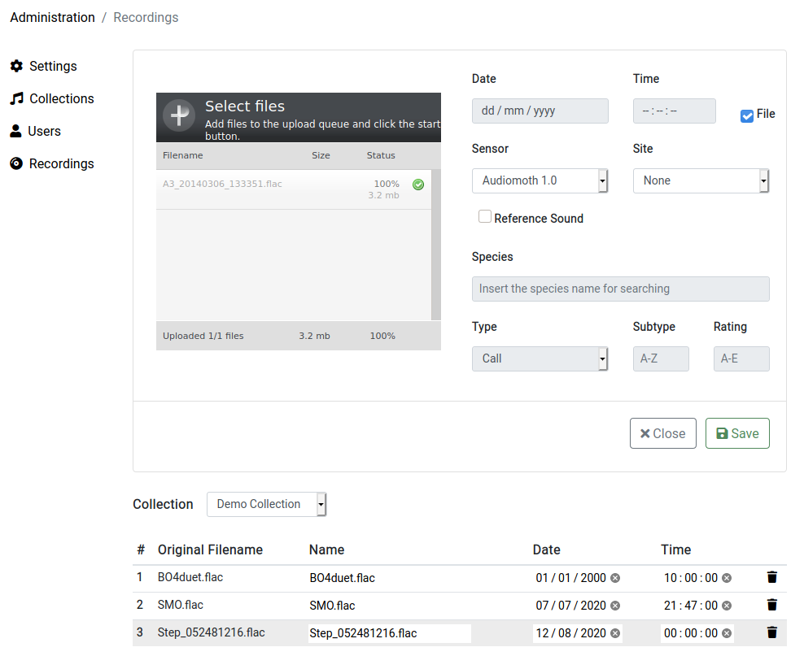
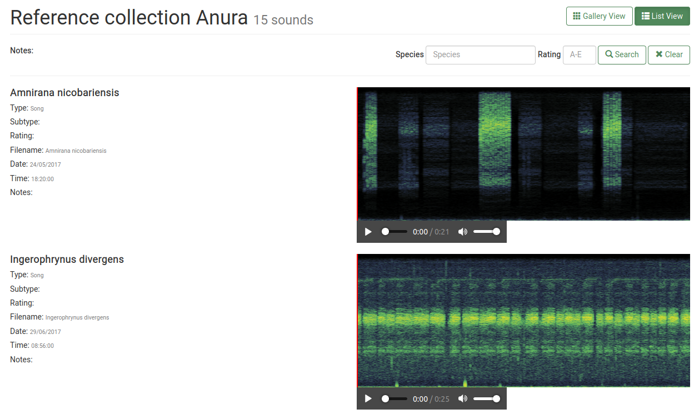
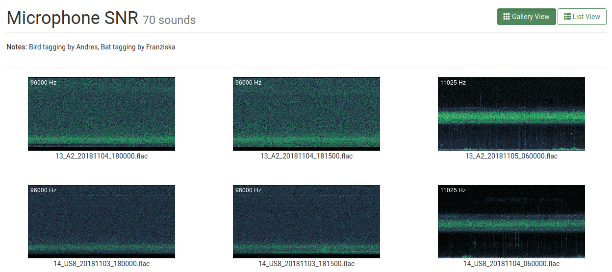
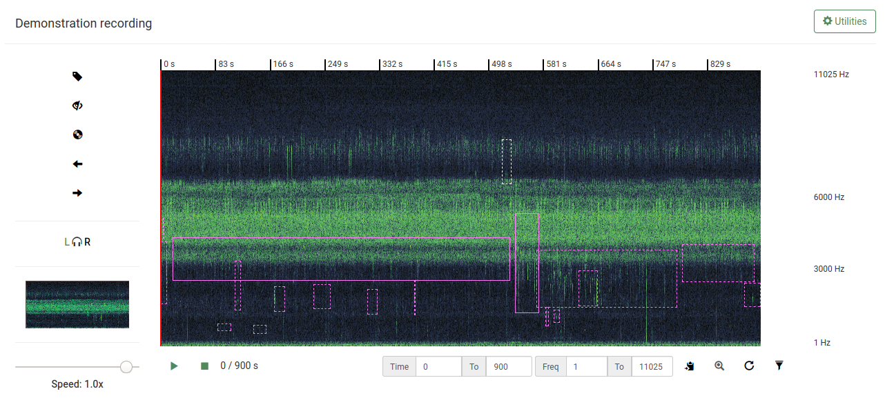
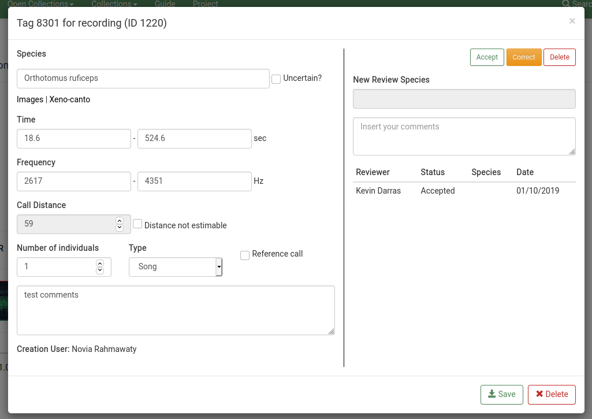

# Collections

## Recordings upload

Administrators can access the administration interface and upload recordings to specific collections by clicking the "upload" button. The date and time of a recording can be automatically extracted from the filename when in the format YYYMMDD_HHMMSS. When the recording is a reference audio for a particular species, the corresponding box can be checked, and the rating, type, subtype, and species be indicated. The recording is inserted into the database (for creating the MP3 preview and spectrogram) by clicking the "save" button.

Recordings can be deleted from this interface, their time and date set a posteriori, and their names in BioSounds edited.

## General organisation
Recordings are organised in collections that you can access from the top drop-down menu. All logged in users have access to all collections, but some are open and publicly available.

In list view, recordings can be played back directly and some of their meta-data are displayed. It is possible to search for recordings that have been assigned to specific species or a particular rating. The list view is the default view for reference collections, and you can open a recording in the player by clicking its thumbnail.

In gallery view, recordings are arranged in a grid. It can take long to load large files with several hundreds of MB, even with a fast internet connection. A recording can be opened in the player by clicking its thumbnail.

# Player

Once you opened a file in the player, you have different options. Buttons that are enabled are shown with green shading.

## Main spectrogram
The spectrogram is the most prominent part of the player. It visualises sound like a music score: time on the X axis, frequency on the Y axis, and amplitude as a color code (black: silent, red: loud). The current default setting is a window size of 1024 for the FFT-derived spectrogram.
If your recording has two audio channels, clicking on the L/R letters next to the main spectrogram switches between the two channels.
The current spectrogram frame, if it only shows a part of the recording, can be shifted with the left and right arrow buttons to the left of the main spectrogram.

## Playback
You can click the playback button to listen to the audio. For listening to ultrasound calls, the playback speed slider can be adjusted to artificially make them audible. The red cursor shows the position in the recording and can be dragged to play back from any part.
The playback time of every user for every recording is logged to be able to derive the sampling/listening intensity for each recording.
Continuous playback can be enabled by clicking the circular arrow below the spectrogram, which will shift the spectrogram frame automatically to enable playback until the end of the recording.
By clicking on the reading mode button to the left of the spectrogram (CD icon), playback will be started from the start of the recording, over all frequencies, with continuous playback mode enabled.

## Selection
Any part of the spectrogram can be selected. The coordinates of the selection will be reflected inside the text boxes below the spectrogram. These values can be copied (delimited by tabs) with the clipboard button next to them and inserted directly into any spreadsheet.

Clicking the zoom button (magnifying glass icon) will zoom into any selected part of the spectrogram. By default, the filtering option is enabled (filter icon), which will filter out frequencies outside of the selection (what you see is what you hear).
You can return to the overview by clicking on the spectrogram thumbnail to the left of the main spectrogram.

# Tags (Annotations)

Tags appear as boxes overlaid on the spectrogram. Tags can be hidden and displayed using the hide tags button (eye icon) left of the main spectrogram. Only the user's own tags can be seen, but every user can be given viewing privileges to see all other user's tags by administrators.
Three actions appear after clicking tags:
1. edit tag: opens you to the tag window
2. zoom tag: zooms into the audio within the tag, prompts for a distance estimate
3. estimate call distance: starts the dedicated call estimation playback

## Tag window
Any spectrogram selection can be used to create a tag by clicking on the tag button (tag icon) to the left of the main spectrogram. This, like editing tags, will bring up the following window:

In the species box, you can start typing in the English or Latin name of the animal and choose the corresponding matches from the list of animals that you have uploaded in your Biosounds installation.

If you are unsure of the ID, check the box “uncertain”. Species identities can be checked by clicking the Google Images link or the Xeno-Canto link.

The frequency and time boxes are automatically filled based on your selection, but the values can be edited manually too after tag creation.
During tag creation, the call distance box is greyed out and the value only appears after using the dedicated call estimation function to estimate distances after a standardised playback.

The number of individuals is 1 by default but can be changed to any integer value. The call type can be chosen, and comments can be input. The tag window shows the creator of the tag.

If the user has reviewing privileges (or is an administrator), the right pane of the tag window will appear, which allows to confirm, revise, or mark tags for deletion. The user and action are logged in a list. Multiple review actions are allowed per user. Tags that have not yet been reviewed appear with dashed borders.

## Call distance estimation

Call distance must be filled only after hearing an unfiltered (frequency-wise) version of the call ([reference](https://besjournals.onlinelibrary.wiley.com/doi/full/10.1111/2041-210X.13031)). Otherwise, filtered audio sounds too unnatural so that the distance estimation could be biased. Distance estimation works only by clicking the distance estimation button (horn icon) after the tag is created.

This zooms in to the first 30 s of the tag and plays it back over the entire frequency range. In parallel, users should listen to the recording's corresponding sound transmission recording to gauge their own hearing to the location's and microphones' specific sound transmission ([reference](https://www.sciencedirect.com/science/article/pii/S0006320716302452)).

Note that for bats, the "distance not estimable" checkbox should be checked. As long as tags have no distance data or not explicitly not estimable distance, they will stand our with an orange shading.
